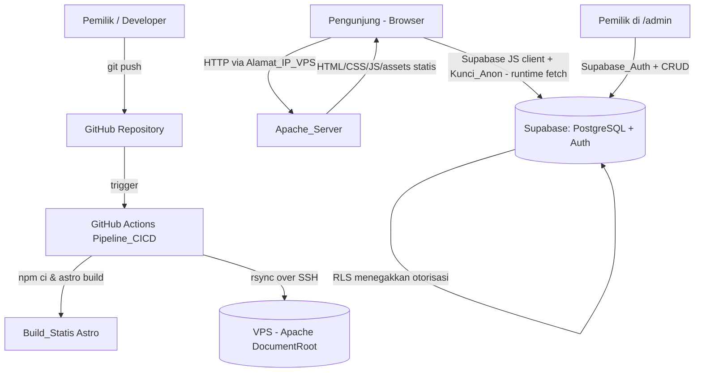
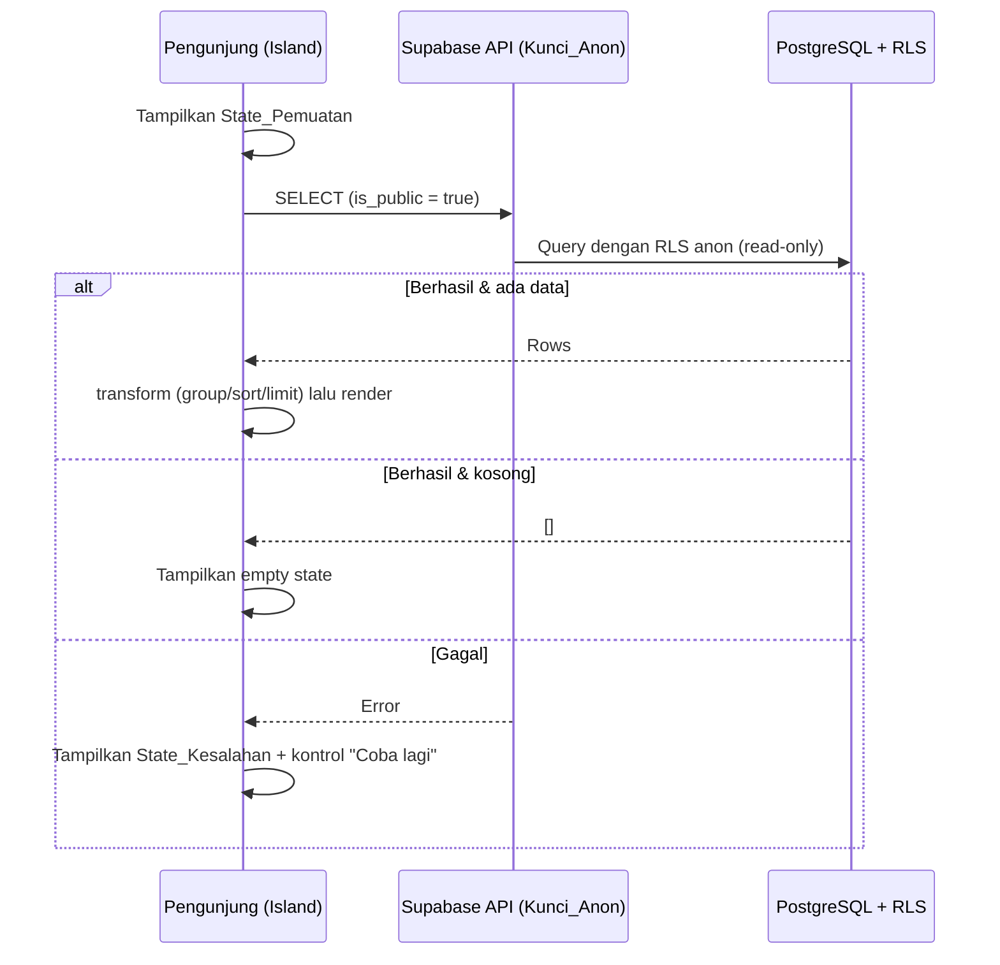
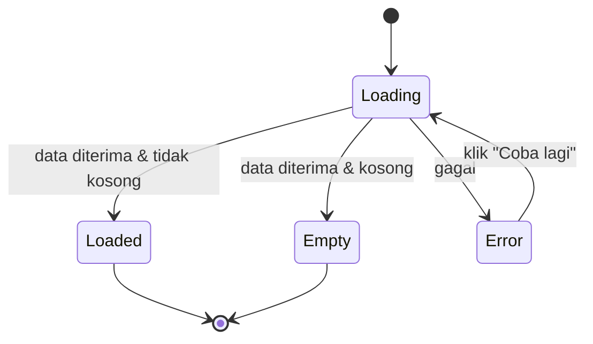
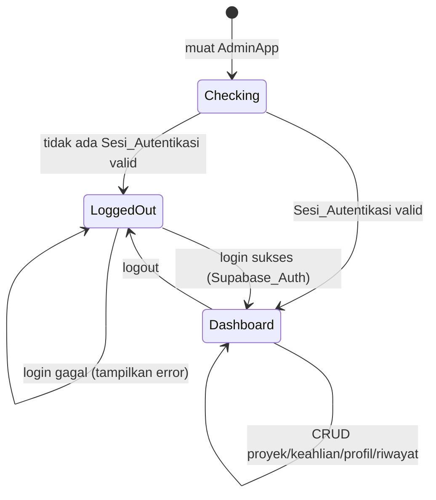
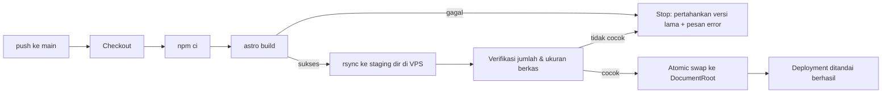

# Design Document

## Overview

Dokumen ini mendefinisikan desain teknis untuk **Portfolio_Website**: situs portofolio statis untuk seorang web/software developer. Situs dibangun dengan **Astro** (output build statis) dan ditata dengan **Tailwind CSS**, lalu dilayani oleh **Apache HTTP Server** di sebuah VPS. Pada fase awal situs diakses melalui Alamat_IP_VPS dengan HTTP; HTTPS/TLS ditunda hingga domain tersedia.

Konten dinamis (Bagian_Tentang, Bagian_Keahlian, Bagian_Proyek, Bagian_Riwayat) **tidak** dibangun ke dalam Build_Statis. Konten tersebut diambil **secara runtime dari peramban Pengunjung** melalui **Supabase JS client** menggunakan **Kunci_Anon** publik. Pengelolaan konten dilakukan melalui **Halaman_Admin** pada rute `/admin` yang dirender di sisi klien, menggunakan **Supabase_Auth** (email + kata sandi, pemilik tunggal) dan operasi CRUD via Supabase JS client.

Prinsip desain utama:

- **Portabilitas**: Lapisan data (Supabase) terpisah penuh dari hosting. Memindahkan situs ke Vercel di masa depan tidak mengubah lapisan data — cukup mengganti target deployment. Tidak ada logika server-side pada VPS selain penyajian berkas statis oleh Apache.
- **Keamanan berlapis di basis data**: Otorisasi ditegakkan oleh **RLS** di PostgreSQL, bukan oleh kode klien. Tidak ada kunci service-role/rahasia dalam Build_Statis atau kode peramban.
- **Ketahanan per-bagian**: Setiap bagian data memiliki State_Pemuatan, State_Kesalahan (dengan kontrol coba lagi), dan empty state yang independen, sehingga kegagalan satu bagian tidak menghentikan bagian lain.
- **Statis dulu, interaktif sesuai kebutuhan (Astro Islands)**: Halaman dirender sebagai HTML statis; hanya bagian interaktif yang di-hydrate sebagai island.

### Pemetaan Requirements ke Area Desain

| Area Desain | Requirements |
|---|---|
| Penyajian bagian publik + state (loading/error/empty) | 1, 2, 3, 15 |
| Keamanan akses data (RLS, kunci) | 4 |
| Navigasi (sticky, smooth scroll, active link) | 5 |
| Kontak (mailto, tautan profesional) | 6 |
| Responsivitas (publik + admin) | 7 |
| Penyajian Apache di VPS (404, 5xx, kompresi) | 8 |
| HTTP fase awal, HTTPS mendatang | 9 |
| Pipeline CI/CD (build, deploy, verifikasi, rollback) | 10 |
| Autentikasi admin | 11 |
| CRUD proyek / keahlian / profil / riwayat | 12, 13, 14, 16 |
| Mode tema terang/gelap | 17 |
| SEO / Open Graph / favicon | 18 |

## Architecture

### High-Level Architecture



Poin penting arsitektur:

- **Build time**: Astro hanya merender kerangka HTML, gaya, dan kode island. Data Supabase **tidak** diambil saat build.
- **Runtime (peramban)**: Island JavaScript memanggil Supabase API langsung dari peramban Pengunjung. Apache tidak pernah menjadi proxy ke Supabase.
- **Otorisasi**: Selalu ditegakkan oleh RLS pada sisi Supabase. Kunci_Anon hanya membuka akses baca terhadap baris publik.

### Strategi Astro Islands (Justifikasi)

Astro menghasilkan HTML statis tanpa JavaScript secara default. Bagian yang memerlukan interaktivitas atau pengambilan data runtime di-hydrate sebagai **island**. Kerangka UI island yang dipilih adalah **React** (`@astrojs/react`), karena ekosistemnya matang untuk form admin dan state management ringan; Svelte/Vue dapat menjadi alternatif tanpa mengubah arsitektur.

| Bagian | Mode render | Direktif hydration | Alasan |
|---|---|---|---|
| Kerangka halaman, layout, head/Meta_Tag | Statis (Astro `.astro`) | — | Konten tetap; harus ada di Build_Statis untuk SEO (Req 18). |
| Skrip tema (anti-FOUC) | Inline blocking script di `<head>` | — | Harus berjalan sebelum paint untuk menghindari kedip tema (Req 17.2, 17.5). |
| Kontrol_Tema (toggle) | Island | `client:load` | Interaktif sejak awal, kecil. |
| Menu_Navigasi (sticky, hamburger, active link) | Island | `client:load` | Butuh scroll-spy & toggle responsif (Req 5, 7.5–7.7). |
| Bagian_Tentang | Island | `client:load` | Above-the-fold; fetch runtime + state (Req 1). |
| Bagian_Keahlian | Island | `client:visible` | Fetch saat masuk viewport untuk hemat permintaan awal (Req 2). |
| Bagian_Proyek | Island | `client:visible` | Idem (Req 3). |
| Bagian_Riwayat | Island | `client:visible` | Idem (Req 15). |
| Bagian_Kontak | Statis | — | Tautan mailto/profesional bersifat statis (Req 6); URL email diinjeksi saat build dari konfigurasi situs. |
| Halaman_Admin `/admin` | Island SPA | `client:only="react"` | Murni client-rendered; berisi auth, routing internal, dan CRUD (Req 11–14, 16). |

### Struktur Direktori (Astro)

```text
portfolio-website/
├─ astro.config.mjs          # output: 'static', integrasi React + Tailwind
├─ tailwind.config.mjs        # darkMode: 'class'
├─ public/
│  ├─ favicon.svg             # favicon (Req 18.6)
│  └─ .htaccess               # konfigurasi Apache (disalin ke DocumentRoot)
├─ src/
│  ├─ config/site.ts          # judul, deskripsi, email, OG image URL, tautan sosial (Req 6, 18)
│  ├─ layouts/BaseLayout.astro# <head>, Meta_Tag, skrip tema, slot konten
│  ├─ lib/
│  │  ├─ supabaseClient.ts    # inisialisasi Supabase JS client (anon)
│  │  ├─ dataAccess.ts        # fungsi baca: getProfile/getSkills/getProjects/getHistory
│  │  ├─ adminApi.ts          # fungsi tulis (CRUD) untuk admin
│  │  ├─ transforms.ts        # logika murni: grouping, sort, limit, format periode
│  │  └─ validation.ts        # logika murni: validasi URL, tanggal, panjang, wajib
│  ├─ components/
│  │  ├─ public/              # AboutIsland, SkillsIsland, ProjectsIsland, HistoryIsland, ThemeToggle, NavBar, StateViews
│  │  └─ admin/               # AdminApp, LoginView, ProjectForm, SkillForm, HistoryForm, ProfileForm
│  └─ pages/
│     ├─ index.astro          # halaman utama (semua bagian publik)
│     ├─ admin/index.astro    # memuat AdminApp (client:only)
│     └─ 404.astro            # halaman 404 kustom (Req 8.2)
└─ .github/workflows/deploy.yml
```

### Alur Data Runtime per Bagian Publik



## Components and Interfaces

### Lapisan Konfigurasi Situs (`src/config/site.ts`)

Nilai statis untuk SEO dan kontak yang dibangun ke dalam Build_Statis. Hanya nilai publik yang aman.

```ts
export interface SiteConfig {
  title: string;            // <title> dan og:title (Req 18.1, 18.2)
  description: string;      // meta description dan og:description
  url: string;              // og:url (Alamat_IP_VPS pada fase awal)
  ogImageUrl: string;       // og:image — URL gambar eksternal (Req 18.4)
  ownerEmail: string;       // alamat mailto (Req 6.1)
  socialLinks: { label: string; href: string }[]; // tautan profesional (Req 6.3)
}
```

Kredensial Supabase publik disuntik via environment variable berawalan `PUBLIC_` (Astro mengekspos ini ke peramban): `PUBLIC_SUPABASE_URL`, `PUBLIC_SUPABASE_ANON_KEY`. Kunci service-role **tidak pernah** dijadikan variabel `PUBLIC_` dan tidak pernah masuk repositori (Req 4.6).

### Supabase Client (`src/lib/supabaseClient.ts`)

```ts
import { createClient } from '@supabase/supabase-js';

export const supabase = createClient(
  import.meta.env.PUBLIC_SUPABASE_URL,
  import.meta.env.PUBLIC_SUPABASE_ANON_KEY,
  { auth: { persistSession: true, autoRefreshToken: true } } // mendukung Req 11.6
);
```

### Lapisan Akses Data Baca (`src/lib/dataAccess.ts`)

Fungsi murni-async yang mengembalikan hasil terbungkus untuk memudahkan penanganan state.

```ts
export type FetchResult<T> =
  | { status: 'ok'; data: T }
  | { status: 'error'; message: string };

export function getProfile(): Promise<FetchResult<Profile | null>>;       // Req 1
export function getSkills(): Promise<FetchResult<Skill[]>>;               // Req 2
export function getProjects(): Promise<FetchResult<Project[]>>;           // Req 3
export function getHistory(): Promise<FetchResult<HistoryEntry[]>>;       // Req 15
```

Setiap fungsi memfilter implisit pada baris publik (ditegakkan oleh RLS) dan tidak melempar exception; kegagalan dikonversi menjadi `{ status: 'error' }` agar island dapat menampilkan State_Kesalahan.

### Lapisan Transformasi Murni (`src/lib/transforms.ts`)

Logika tanpa efek samping — inti yang diuji dengan property-based testing.

```ts
// Mengelompokkan keahlian ke 3 kategori tetap (Req 2.4)
export function groupSkills(skills: Skill[]): {
  language: Skill[]; framework: Skill[]; tool: Skill[];
};

// Membatasi tampilan ke maksimum 50 entri pertama (Req 2.8)
export function limitSkills(skills: Skill[], max = 50): Skill[];

// Mengurutkan riwayat berdasarkan start_date menurun (terbaru -> terlama) (Req 15.5)
export function sortHistoryDesc(entries: HistoryEntry[]): HistoryEntry[];

// Memformat periode; end_date kosong -> mengandung "sekarang" (Req 15.4)
export function formatPeriod(start: string, end: string | null): string;
```

### Lapisan Validasi Murni (`src/lib/validation.ts`)

Digunakan oleh form admin sebelum operasi tulis.

```ts
export function isValidUrl(text: string): boolean;                 // Req 12.4, 14.4
export function validateProject(input: ProjectInput): FieldErrors; // Req 12.2–12.4
export function validateSkill(input: SkillInput): FieldErrors;     // Req 13.2–13.3
export function validateProfile(input: ProfileInput): FieldErrors; // Req 14.2–14.4
export function validateHistory(input: HistoryInput): FieldErrors; // Req 16.2–16.4
// FieldErrors = Record<string, string>; kosong berarti valid.
```

Aturan validasi yang ditegakkan:

- Proyek: `title` wajib & ≤100 karakter; `description` wajib & ≤300 karakter; `github_url` wajib; `demo_url`/`preview_image_url` opsional namun jika diisi harus URL sah.
- Keahlian: `name` wajib; `category` ∈ {language, framework, tool}; `level` opsional namun jika ada harus bilangan bulat 1–5.
- Profil: `name` wajib; `description` wajib & 1–500 karakter; `photo_url` opsional namun jika diisi harus URL sah.
- Riwayat: `role_title`, `institution`, `start_date` wajib; `end_date` opsional; jika `end_date` diisi maka `end_date` ≥ `start_date`.

### Komponen Bagian Publik (Islands)

Setiap island bagian-data mengikuti mesin state seragam:



| Island | Tanggung jawab | Requirements |
|---|---|---|
| `AboutIsland` | Fetch profil; render nama, foto (fallback placeholder bila gagal load), deskripsi | 1.1–1.7 |
| `SkillsIsland` | Fetch keahlian; `groupSkills` + `limitSkills`; indikator level 1–5; empty state | 2.1–2.8 |
| `ProjectsIsland` | Fetch proyek; kartu judul/deskripsi/preview (fallback placeholder), tag tech stack, tautan GitHub & demo `target="_blank" rel="noopener noreferrer"`; empty state | 3.1–3.10 |
| `HistoryIsland` | Fetch riwayat; `sortHistoryDesc`; `formatPeriod`; empty state | 15.1–15.7 |
| `NavBar` | 5 tautan; sticky; smooth scroll; active link via scroll-spy (IntersectionObserver); hamburger <768px | 5.1–5.5, 7.5–7.7 |
| `ThemeToggle` | Alihkan kelas `dark` pada `<html>`, simpan ke localStorage | 17.1, 17.3, 17.4 |
| Komponen `StateViews` | Spinner, pesan error + tombol "Coba lagi", empty message | 1.2/1.6, 2.2/2.6/2.7, 3.2/3.8/3.9, 15.2/15.6/15.7 |

`NavBar` menggunakan `IntersectionObserver` untuk menandai tepat satu tautan aktif sesuai bagian yang sedang terlihat. Penggeseran menggunakan `scrollIntoView({ behavior: 'smooth' })` dengan offset tinggi navbar agar bagian berada di atas viewport.

### Komponen Halaman Admin (Island SPA)

`AdminApp` adalah satu island `client:only="react"` yang mengelola routing internal berbasis state (tanpa sub-rute server, agar kompatibel dengan penyajian statis Apache).



| Komponen | Tanggung jawab | Requirements |
|---|---|---|
| `AdminApp` | Cek sesi via `supabase.auth.getSession()`; lindungi rute; render Login atau Dashboard | 11.1, 11.6, 11.7 |
| `LoginView` | Form email+kata sandi; `signInWithPassword`; tampilkan error autentikasi | 11.2, 11.3 |
| `Dashboard` | Navigasi tab + aksi logout (`signOut`) | 11.4, 11.5 |
| `ProjectForm`/`ProjectList` | CRUD proyek + validasi | 12.1–12.8 |
| `SkillForm`/`SkillList` | CRUD keahlian + validasi | 13.1–13.7 |
| `ProfileForm` | Edit satu rekaman profil + validasi | 14.1–14.7 |
| `HistoryForm`/`HistoryList` | CRUD riwayat + validasi tanggal | 16.1–16.8 |

`AdminApp` memantau perubahan auth melalui `supabase.auth.onAuthStateChange` agar kedaluwarsa sesi langsung mengembalikan ke `LoginView` (Req 11.7).

### Lapisan Tulis Admin (`src/lib/adminApi.ts`)

```ts
export type WriteResult = { ok: true } | { ok: false; message: string };

export function createProject(i: ProjectInput): Promise<WriteResult>;   // Req 12.5
export function updateProject(id: string, i: ProjectInput): Promise<WriteResult>;
export function deleteProject(id: string): Promise<WriteResult>;        // Req 12.7
// pola serupa untuk skill, history, dan updateProfile (Req 13, 14, 16)
```

Setiap operasi tulis: (1) jalankan validasi murni; jika ada error → kembalikan tanpa memanggil Supabase; (2) panggil Supabase; jika gagal → kembalikan `{ ok: false }` dan UI mempertahankan data sebelumnya (Req 12.8, 13.7, 14.7, 16.8). Otorisasi tetap ditegakkan RLS sehingga operasi tanpa sesi valid pasti ditolak server (Req 4.5).

### Sistem Tema (`BaseLayout.astro`)

Skrip blocking inline dijalankan sebelum render untuk mencegah FOUC:

```html
<script is:inline>
  (function () {
    var stored = localStorage.getItem('theme');           // Req 17.5
    var sysDark = window.matchMedia('(prefers-color-scheme: dark)').matches; // Req 17.2
    var theme = stored ? stored : (sysDark ? 'dark' : 'light');
    document.documentElement.classList.toggle('dark', theme === 'dark');
  })();
</script>
```

`ThemeToggle` membalik kelas `dark` dan menulis `localStorage.theme` (Req 17.3, 17.4). Palet warna Tailwind dipilih agar rasio kontras teks/latar ≥ 4.5:1 pada kedua mode (Req 17.6); nilai kontras divalidasi pada Testing Strategy.

### Layout SEO / Meta (`BaseLayout.astro`)

`<head>` dirender statis dari `site.ts` (Req 18): `<title>`, `meta[name=description]`, Open Graph (`og:title`, `og:description`, `og:image`, `og:url`), Twitter card (`twitter:card=summary_large_image`, `twitter:title`, `twitter:description`, `twitter:image`), dan `<link rel="icon">`. `og:image` dan `twitter:image` merujuk URL eksternal dari konfigurasi (Req 18.4). Tag hanya dirender bila nilainya dikonfigurasi (Req 18.5).

### Konfigurasi Apache (`public/.htaccess` + vhost)

- **DocumentRoot**: berkas Build_Statis disalin ke direktori root dokumen terkonfigurasi (Req 8.3).
- **404**: `ErrorDocument 404 /404.html` menyajikan halaman 404 kustom dari Astro (Req 8.2).
- **Kompresi**: `mod_deflate` mengaktifkan kompresi untuk `text/html`, `text/css`, `application/javascript` (Req 8.4).
- **Routing klien `/admin`**: Astro menghasilkan `/admin/index.html`. Karena routing admin berbasis state (bukan sub-rute), `/admin` cukup melayani `index.html`. `FallbackResource` atau aturan rewrite memetakan permintaan dalam `/admin` ke `/admin/index.html` untuk berjaga-jaga terhadap refresh path dalam.
- **HTTP fase awal**: tidak ada pengalihan ke HTTPS (Req 9.1, 9.2). Konfigurasi TLS disiapkan sebagai langkah mendatang setelah domain tersedia (Req 9.3), tanpa mengubah lapisan data.

```apache
# Cuplikan .htaccess
ErrorDocument 404 /404.html
<IfModule mod_deflate.c>
  AddOutputFilterByType DEFLATE text/html text/css application/javascript
</IfModule>
<IfModule mod_rewrite.c>
  RewriteEngine On
  RewriteCond %{REQUEST_FILENAME} !-f
  RewriteCond %{REQUEST_URI} ^/admin
  RewriteRule . /admin/index.html [L]
</IfModule>
```

### Pipeline CI/CD (`.github/workflows/deploy.yml`)



Karakteristik pipeline:

- Trigger pada `push` ke branch utama (Req 10.1).
- Build Astro; jika gagal, langkah deploy tidak dijalankan dan versi lama dipertahankan (Req 10.5).
- Transfer via `rsync` over SSH menggunakan GitHub Secrets (`VPS_HOST`, `VPS_USER`, `SSH_PRIVATE_KEY`, `VPS_TARGET_DIR`). Build_Statis dikirim ke direktori staging, lalu dipindahkan secara atomik (rename/symlink) ke DocumentRoot agar penyajian beralih ke versi terbaru dengan cepat (Req 10.2, 10.4).
- **Verifikasi**: bandingkan jumlah berkas dan ukuran total antara sumber dan tujuan sebelum menandai berhasil; jika tidak cocok atau ada berkas gagal disalin, hentikan dan pertahankan versi lama (Req 10.3, 10.6).
- **Timeout**: `timeout-minutes` total ≤ 5 menit; bila terlampaui, job dibatalkan dan versi lama tetap dipertahankan (Req 10.2, 10.7).
- Variabel `PUBLIC_SUPABASE_URL` dan `PUBLIC_SUPABASE_ANON_KEY` diinjeksi dari Secrets saat build; tidak ada kunci rahasia/service-role (Req 4.6).

## Data Models

### Skema PostgreSQL (Supabase)

Semua tabel memiliki kolom `is_public boolean NOT NULL DEFAULT true` sebagai penanda baris yang dapat dibaca publik (Req 4.2), serta `created_at`/`updated_at` untuk audit ringan.

```sql
-- Tabel profil (rekaman tunggal Bagian_Tentang)
create table profile (
  id uuid primary key default gen_random_uuid(),
  name text not null,
  photo_url text,                       -- URL gambar eksternal, opsional
  description text not null check (char_length(description) between 1 and 500), -- Req 1.5, 14.2
  is_public boolean not null default true,
  updated_at timestamptz not null default now()
);

-- Tabel keahlian
create table skills (
  id uuid primary key default gen_random_uuid(),
  name text not null,
  category text not null check (category in ('language','framework','tool')), -- Req 2.4, 13.2
  level smallint check (level between 1 and 5),  -- opsional, skala 1-5 (Req 2.5, 13.2)
  sort_order int not null default 0,
  is_public boolean not null default true,
  created_at timestamptz not null default now()
);

-- Tabel proyek
create table projects (
  id uuid primary key default gen_random_uuid(),
  title text not null check (char_length(title) <= 100),        -- Req 3.3, 12.2
  description text not null check (char_length(description) <= 300), -- Req 3.3, 12.2
  tech_stack text[] not null default '{}',                      -- tag (Req 3.4)
  github_url text not null,                                     -- wajib (Req 3.5, 12.2)
  demo_url text,                                                -- opsional (Req 3.6)
  preview_image_url text,                                       -- URL eksternal opsional (Req 3.3)
  sort_order int not null default 0,
  is_public boolean not null default true,
  created_at timestamptz not null default now()
);

-- Tabel riwayat (pengalaman & pendidikan)
create table history (
  id uuid primary key default gen_random_uuid(),
  role_title text not null,             -- posisi/gelar (Req 15.3, 16.2)
  institution text not null,            -- instansi/institusi
  start_date date not null,             -- wajib (Req 16.2)
  end_date date,                        -- kosong => "sekarang" (Req 15.4)
  description text,                     -- opsional
  is_public boolean not null default true,
  created_at timestamptz not null default now(),
  constraint end_after_start check (end_date is null or end_date >= start_date) -- Req 16.4
);
```

### Tipe Domain (TypeScript)

```ts
export type SkillCategory = 'language' | 'framework' | 'tool';

export interface Profile { id: string; name: string; photoUrl: string | null; description: string; }
export interface Skill { id: string; name: string; category: SkillCategory; level: number | null; sortOrder: number; }
export interface Project { id: string; title: string; description: string; techStack: string[]; githubUrl: string; demoUrl: string | null; previewImageUrl: string | null; sortOrder: number; }
export interface HistoryEntry { id: string; roleTitle: string; institution: string; startDate: string; endDate: string | null; description: string | null; }
```

### Kebijakan RLS (Row Level Security)

RLS diaktifkan pada keempat tabel. Klien Kunci_Anon hanya boleh **membaca** baris publik; peran `authenticated` (Pemilik tunggal yang login via Supabase_Auth) boleh menulis/memperbarui/menghapus (Req 4.2–4.5).

```sql
alter table profile  enable row level security;
alter table skills   enable row level security;
alter table projects enable row level security;
alter table history  enable row level security;

-- Baca publik: hanya baris is_public = true untuk peran anon & authenticated
create policy "public_read_profile"  on profile  for select using (is_public = true);
create policy "public_read_skills"   on skills   for select using (is_public = true);
create policy "public_read_projects" on projects for select using (is_public = true);
create policy "public_read_history"  on history  for select using (is_public = true);

-- Tulis/ubah/hapus: hanya peran authenticated (Pemilik), berlaku untuk keempat tabel
create policy "owner_write_profile"  on profile  for all to authenticated using (true) with check (true);
create policy "owner_write_skills"   on skills   for all to authenticated using (true) with check (true);
create policy "owner_write_projects" on projects for all to authenticated using (true) with check (true);
create policy "owner_write_history"  on history  for all to authenticated using (true) with check (true);
```

Catatan keamanan:

- Tidak ada policy INSERT/UPDATE/DELETE untuk peran `anon`, sehingga permintaan tulis dari Kunci_Anon otomatis ditolak (Req 4.3).
- Karena Pemilik adalah pengguna tunggal, peran `authenticated` setara dengan Pemilik. Bila di masa depan ada banyak pengguna, policy dapat dipersempit dengan `auth.uid()`.
- Kunci service-role tidak pernah dikirim ke peramban; hanya Kunci_Anon publik yang digunakan klien (Req 4.1, 4.6).

## Correctness Properties

*Sebuah properti adalah karakteristik atau perilaku yang harus selalu benar di seluruh eksekusi sistem yang valid — pada dasarnya pernyataan formal tentang apa yang harus dilakukan sistem. Properti menjadi jembatan antara spesifikasi yang dapat dibaca manusia dan jaminan kebenaran yang dapat diverifikasi mesin.*

Properti berikut menargetkan logika murni pada lapisan transformasi (`transforms.ts`), validasi (`validation.ts`), tema, navigasi, dan render meta. Logika ini diuji dengan property-based testing. Perilaku eksternal (RLS Supabase, Apache, pipeline CI/CD) diverifikasi melalui uji integrasi/smoke, bukan PBT (lihat Testing Strategy).

### Property 1: Pengelompokan keahlian mempertahankan keanggotaan

*Untuk setiap* daftar keahlian, `groupSkills` mempartisi seluruh entri ke tepat tiga kategori (language, framework, tool) tanpa kehilangan, menduplikasi, atau memindahkan entri ke kategori yang salah; gabungan ketiga grup adalah permutasi dari daftar masukan dan setiap entri berada pada grup yang sama dengan nilai `category`-nya.

**Validates: Requirements 2.4**

### Property 2: Pembatasan keahlian ke 50 entri pertama

*Untuk setiap* daftar keahlian berukuran sembarang, `limitSkills` mengembalikan tepat `min(panjang, 50)` entri yang merupakan prefiks berurutan dari daftar masukan.

**Validates: Requirements 2.8**

### Property 3: Riwayat terurut kronologis menurun

*Untuk setiap* daftar entri riwayat, `sortHistoryDesc` menghasilkan permutasi dari masukan yang monoton tidak-naik berdasarkan `startDate` (entri terbaru lebih dahulu daripada entri terlama).

**Validates: Requirements 15.5**

### Property 4: Format periode menandai entri berjalan

*Untuk setiap* entri riwayat, hasil `formatPeriod` mengandung penanda "sekarang" jika dan hanya jika `endDate` bernilai null; bila `endDate` ada, keluaran memuat representasi tanggal selesai tersebut.

**Validates: Requirements 15.4**

### Property 5: Validasi proyek menegakkan kolom wajib, batas panjang, dan URL

*Untuk setiap* masukan proyek, `validateProject` menghasilkan kumpulan error kosong (valid) jika dan hanya jika `title` tidak kosong dan ≤100 karakter, `description` tidak kosong dan ≤300 karakter, `githubUrl` tidak kosong, dan setiap dari `demoUrl`/`previewImageUrl` yang terisi merupakan URL yang sah.

**Validates: Requirements 12.3, 12.4**

### Property 6: Validasi keahlian menegakkan kolom wajib, kategori, dan skala level

*Untuk setiap* masukan keahlian, `validateSkill` valid jika dan hanya jika `name` tidak kosong, `category` ∈ {language, framework, tool}, dan `level` bernilai null atau bilangan bulat dalam rentang 1–5.

**Validates: Requirements 13.3, 2.5**

### Property 7: Validasi profil menegakkan kolom wajib, panjang deskripsi, dan URL foto

*Untuk setiap* masukan profil, `validateProfile` valid jika dan hanya jika `name` tidak kosong, `description` memiliki panjang antara 1 dan 500 karakter, dan `photoUrl` yang terisi merupakan URL yang sah.

**Validates: Requirements 1.5, 14.3, 14.4**

### Property 8: Validasi riwayat menegakkan kolom wajib dan urutan tanggal

*Untuk setiap* masukan riwayat, `validateHistory` valid jika dan hanya jika `roleTitle`, `institution`, dan `startDate` tidak kosong, dan `endDate` bernilai null atau tidak lebih awal dari `startDate`.

**Validates: Requirements 16.3, 16.4**

### Property 9: Resolusi tampilan admin berdasarkan sesi

*Untuk setiap* state sesi, `resolveAdminView` mengembalikan `'dashboard'` jika dan hanya jika terdapat Sesi_Autentikasi yang valid dan belum kedaluwarsa; untuk sesi yang tidak ada atau telah kedaluwarsa, hasilnya selalu `'login'`.

**Validates: Requirements 11.1, 11.6, 11.7**

### Property 10: Resolusi tema memprioritaskan preferensi tersimpan

*Untuk setiap* kombinasi preferensi tersimpan dan preferensi sistem, `resolveTheme` mengembalikan preferensi tersimpan bila ada, dan jika tidak ada, mengembalikan preferensi sistem (`prefers-color-scheme`).

**Validates: Requirements 17.2, 17.5**

### Property 11: Toggle tema bersifat involusi

*Untuk setiap* nilai tema, `toggleTheme` menghasilkan tema yang berbeda dari masukan, dan menerapkannya dua kali mengembalikan tema semula (`toggleTheme(toggleTheme(t)) == t`).

**Validates: Requirements 17.3**

### Property 12: Persistensi tema bersifat round-trip

*Untuk setiap* nilai tema yang dipersistenkan ke penyimpanan, pembacaan kembali melalui `resolveTheme` menghasilkan nilai tema yang sama.

**Validates: Requirements 17.4**

### Property 13: Kontras warna memenuhi ambang aksesibilitas

*Untuk setiap* pasangan token warna teks dan latar yang didefinisikan dalam palet tema terang maupun gelap, rasio kontras yang dihitung ≥ 4.5:1.

**Validates: Requirements 17.6**

### Property 14: Tepat satu tautan navigasi aktif sesuai bagian terlihat

*Untuk setiap* bagian yang ditetapkan sebagai bagian yang sedang terlihat, fungsi penentu tautan aktif menandai tepat satu tautan Menu_Navigasi sebagai aktif, dan tautan tersebut adalah tautan yang menuju bagian itu.

**Validates: Requirements 5.4, 5.5**

### Property 15: Tautan eksternal dibuka di tab baru dengan aman

*Untuk setiap* proyek, setiap anchor tautan eksternal yang dirender (repositori GitHub dan demo bila ada) memiliki atribut `target="_blank"` dan `rel` yang mengandung `noopener`.

**Validates: Requirements 3.7**

### Property 16: Tautan mailto teralamat dengan benar

*Untuk setiap* alamat email yang dikonfigurasi, tautan kontak yang dihasilkan memiliki `href` tepat sama dengan `"mailto:" + email` dan menampilkan alamat email tersebut.

**Validates: Requirements 6.1**

### Property 17: Render meta tag hanya untuk nilai yang dikonfigurasi

*Untuk setiap* konfigurasi situs (mungkin parsial), fungsi render meta menyertakan sebuah Meta_Tag jika dan hanya jika nilai yang bersesuaian terisi, dan tidak pernah menghasilkan Meta_Tag berkonten kosong.

**Validates: Requirements 18.5**

## Error Handling

### Kesalahan Pengambilan Data Publik (per bagian)

Setiap island bagian-data menangani kegagalan secara independen sehingga kegagalan satu bagian tidak menghentikan bagian lain (Req 1.6, 2.7, 3.9, 15.7):

- **Gagal jaringan/Supabase**: `dataAccess` mengonversi exception menjadi `{ status: 'error', message }`. Island menampilkan State_Kesalahan berisi pesan ramah pengguna dan tombol "Coba lagi" yang memicu ulang fetch (kembali ke State_Pemuatan).
- **Sukses namun kosong**: Island menampilkan empty state spesifik bagian (Req 2.6, 3.8, 15.6).
- **Gambar eksternal gagal dimuat**: Handler `onerror` pada elemen `` mengganti sumber dengan placeholder lokal sambil mempertahankan konten lain (Req 1.7, 3.10).

### Kesalahan Operasi Tulis Admin

- **Validasi klien gagal**: Operasi tulis dibatalkan sebelum memanggil Supabase; pesan validasi per kolom ditampilkan (Req 12.3/12.4, 13.3, 14.3/14.4, 16.3/16.4).
- **Operasi Supabase gagal** (termasuk penolakan RLS): `adminApi` mengembalikan `{ ok: false, message }`. UI menampilkan pesan kesalahan dan mempertahankan data sebelumnya tanpa perubahan optimistic yang tidak ter-commit (Req 12.8, 13.7, 14.7, 16.8).
- **Sesi kedaluwarsa saat operasi**: Penolakan oleh RLS/Auth memicu `onAuthStateChange`, mengembalikan admin ke `LoginView` (Req 11.7).

### Kesalahan Autentikasi

- Kredensial salah → pesan kesalahan autentikasi generik tanpa membocorkan apakah email atau kata sandi yang salah (Req 11.3).
- Akses `/admin` tanpa sesi valid → render `LoginView`, sembunyikan kontrol admin (Req 11.1).

### Kesalahan Penyajian Apache

- Sumber daya tidak ditemukan → 404 dengan halaman kustom (Req 8.2).
- Kegagalan internal → 5xx tanpa mengubah Build_Statis di VPS (Req 8.5).

### Kesalahan Pipeline CI/CD

- Build gagal → hentikan deploy, pertahankan versi lama, tampilkan log penyebab (Req 10.5).
- Gagal salin/verifikasi tidak cocok → hentikan swap, pertahankan versi lama, tampilkan pesan (Req 10.6).
- Timeout >300 detik → batalkan job, pertahankan versi lama, tandai gagal dengan pesan timeout (Req 10.7).

## Testing Strategy

Pendekatan pengujian bersifat ganda: **unit/contoh** untuk perilaku spesifik dan edge case, **property-based** untuk properti universal logika murni, serta **integration/smoke** untuk perilaku eksternal yang tidak cocok untuk PBT.

### Property-Based Testing

- **Library**: `fast-check` dipadukan dengan **Vitest** (selaras dengan ekosistem Astro/Vite). PBT tidak diimplementasikan dari nol.
- **Iterasi minimum**: setiap property test dijalankan ≥ 100 iterasi (`{ numRuns: 100 }`).
- **Cakupan**: 17 properti pada bagian Correctness Properties, menargetkan `transforms.ts`, `validation.ts`, util tema, util navigasi, util mailto, dan util render meta.
- **Penandaan**: setiap property test diberi komentar dengan format:
  `// Feature: portfolio-website, Property {number}: {property_text}`
- **Generator**: arbitraries kustom untuk `Skill`, `Project`, `HistoryEntry`, pasangan tanggal (termasuk kasus end<start, end=start, end=null), string termasuk whitespace dan string melebihi batas panjang, kandidat URL valid/invalid, serta token warna palet — agar edge case (Req 1.5, 2.5, 2.8, 16.4) tercakup generator.
- Setiap properti diimplementasikan sebagai **satu** property test.

### Unit / Example Testing

Untuk kriteria yang diklasifikasikan EXAMPLE/EDGE_CASE pada prework — mesin state island (loading/loaded/empty/error), fallback gambar placeholder, struktur 5 tautan navigasi, sticky/hamburger, render form admin, pemertahanan data saat tulis gagal, kehadiran title/OG/Twitter/favicon di head. Gunakan Vitest + Testing Library untuk komponen island; mock Supabase client. Jumlah unit test dijaga secukupnya karena cakupan input luas sudah ditangani PBT.

### Integration Testing

Untuk perilaku eksternal (tidak cocok PBT), gunakan 1–3 contoh representatif:

- **RLS Supabase** (Req 4.2–4.5): uji terhadap instance Supabase — anon dapat membaca baris publik, anon ditolak menulis, sesi owner dapat menulis, klien tanpa sesi ditolak menulis.
- **Akses data runtime** (Req 1.1, 2.1, 3.1, 15.1; 12.5/12.6, 13.4/13.5, 14.5/14.6, 16.5/16.6): mock atau instance uji untuk memverifikasi pembacaan dan pencerminan perubahan pada pemuatan berikutnya.
- **Apache** (Req 8.1–8.6, 9.1, 9.2): uji HTTP — status 200 halaman utama, 404 kustom, header kompresi pada berkas teks, tanpa redirect HTTPS pada fase awal.
- **Pipeline CI/CD** (Req 10): uji workflow pada branch percobaan — build sukses men-deploy, build gagal mempertahankan versi lama, verifikasi jumlah/ukuran berkas berjalan.

### Smoke Testing

- Inisialisasi Supabase client memakai Kunci_Anon dari env publik (Req 4.1).
- Pemindaian output build memastikan tidak ada kunci service-role/rahasia (Req 4.6).
- Konfigurasi TLS sebagai langkah mendatang saat domain tersedia (Req 9.3).

### Catatan Aksesibilitas

Rasio kontras (Req 17.6) diverifikasi melalui Property 13 atas token palet. Validasi WCAG menyeluruh tetap memerlukan pengujian manual dengan teknologi bantu dan tinjauan ahli aksesibilitas; pengujian otomatis di sini memvalidasi ambang kontras terukur, bukan kepatuhan WCAG penuh.
